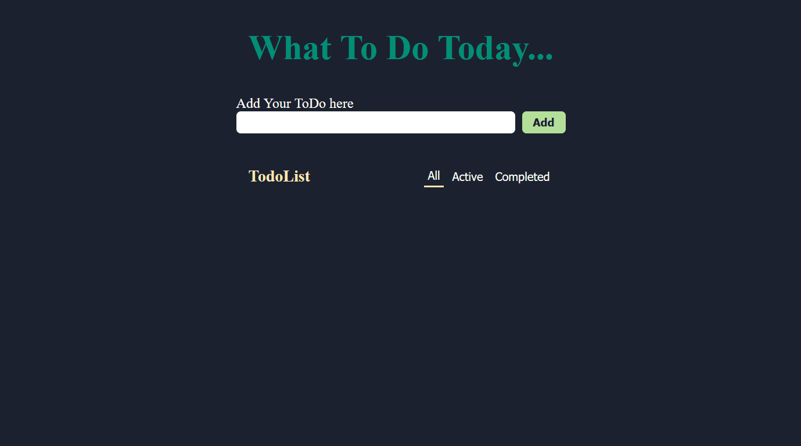

# 📝 Todo App

A simple and clean **Todo List web application** built with **HTML, CSS, and JavaScript**.

This project was created to strengthen my JavaScript fundamentals through practical development. It focuses on **DOM manipulation, event handling, application state, array methods, localStorage, and dynamically generated HTML elements**.

## 📸 Preview



## 🚀 Features

* ➕ Add new todos
* ⌨️ Add todos using the **Enter** key
* ☑️ Mark todos as completed using a custom checkbox
* 🖱️ Click the todo text to mark it as completed
* 🗑️ Delete todos
* 🕐 Display the time when a todo was created
* 💾 Save todos using **localStorage**
* 🔄 Restore todos automatically after page refresh
* 🔄 Preserve completed status after page refresh
* 🚫 Prevent empty todos from being added
* 🎨 Custom dark-themed UI
* 📱 Simple and lightweight design

## 🛠️ Technologies Used

* **HTML5** — Structure of the application
* **CSS3** — Styling, layout, custom checkbox, and completed-state styling
* **JavaScript (ES6+)** — Application logic, state management, DOM manipulation, and event handling
* **Web Storage API** — Persistent todo data using `localStorage`

## 📂 Project Structure

```text
Todo-App/
│
├── index.html
│
├── src/
│   ├── css/
│   │   └── style.css
│   │
│   └── js/
│       └── script.js
│
├── screenshot.png
│
└── README.md
```

## ⚙️ How It Works

### 1. Adding a Todo

The user enters a task in the input field and clicks the **Add** button.

JavaScript then:

1. Gets the text from the input.
2. Removes unnecessary whitespace using `trim()`.
3. Validates that the input isn't empty.
4. Creates a Todo object with a unique ID.
5. Stores the Todo in the `todos` array.
6. Records the creation time.
7. Saves the updated Todo list to `localStorage`.
8. Dynamically renders the Todo on the page.
9. Clears the input field.

Each Todo is stored in a structure similar to:

```js
{
    id: "unique-id",
    text: "Learn JavaScript",
    completed: false,
    time: "13:05"
}
```

### 2. Adding with Enter

Users can press **Enter** while typing in the input field instead of clicking the **Add** button.

The `keydown` event detects the Enter key and triggers the same Todo creation process.

### 3. Completing a Todo

Each Todo contains a custom checkbox.

When the checkbox is changed:

1. The Todo's ID is retrieved from the element's `data-id`.
2. The corresponding Todo is found in the `todos` array.
3. Its `completed` property is updated.
4. A `completed` CSS class is added or removed.
5. The updated Todo list is saved to `localStorage`.

Users can also click directly on the Todo text to toggle its completed state.

### 4. Deleting a Todo

Each Todo has a **Delete** button.

When clicked:

1. The Todo's ID is retrieved.
2. The corresponding Todo is removed from the `todos` array using `filter()`.
3. The Todo element is removed from the DOM.
4. The updated Todo list is saved to `localStorage`.

### 5. Local Storage

Todos are stored in the browser using `localStorage`.

Since `localStorage` stores data as strings, the Todo array is converted using:

```js
JSON.stringify(todos)
```

When the application starts, the stored data is retrieved and converted back into JavaScript objects using:

```js
JSON.parse(savedTodos)
```

Saved Todos are then rendered automatically.

This allows Todo data to remain available even after refreshing the page.

## 🧠 JavaScript Concepts Practiced

This project helped me practice several important JavaScript concepts:

### DOM Manipulation

* `document.getElementById()`
* `document.querySelector()`
* `document.createElement()`
* `classList.add()`
* `classList.toggle()`
* `classList.remove()`
* `dataset`
* `innerHTML`
* `appendChild()`
* `element.remove()`
* `closest()`

### Events

* `addEventListener()`
* `click`
* `change`
* `keydown`
* Event delegation
* `event.target`

### JavaScript Fundamentals

* Variables
* Arrays
* Objects
* Functions
* Arrow functions
* `find()`
* `filter()`
* Template literals
* Conditional expressions
* `crypto.randomUUID()`
* `Date`
* `String.prototype.padStart()`

### Data Persistence

* `localStorage.setItem()`
* `localStorage.getItem()`
* `JSON.stringify()`
* `JSON.parse()`

### Application State

The project uses the `todos` array as the main source of application state.

Changes to the state are reflected in the DOM and saved to localStorage.

```text
User Action
     ↓
Update todos[]
     ↓
Update DOM
     ↓
Save to localStorage
```

## 🎨 UI

The application uses a dark-themed interface with green and light-colored accents.

Todo items are displayed using **CSS Grid**, keeping the checkbox, task text, delete button, and creation time properly aligned.

Completed todos are visually distinguished using:

* Strikethrough text
* Reduced opacity
* Italic styling
* Custom checkbox state

## 📸 Screenshot


> Replace `screenshot.png` with your actual screenshot file if you use a different filename or location.

## 🔮 Future Improvements

Possible improvements for future versions:

* [ ] Edit existing todos
* [ ] Show the number of completed and pending todos
* [ ] Add a **Clear All** button
* [ ] Add filtering for **All / Active / Completed**
* [ ] Improve responsive design for smaller screens
* [ ] Add animations and transitions
* [ ] Add confirmation before deleting a Todo
* [ ] Add task priority
* [ ] Add due dates
* [ ] Add categories or tags
* [ ] Improve accessibility
* [ ] Add drag-and-drop Todo reordering

## 🎯 Purpose of the Project

The main goal of this project is to strengthen my **JavaScript fundamentals by building a practical application without relying on a framework**.

Instead of only following tutorials, I am using this project to practice how JavaScript manages application state, interacts with the DOM, responds to user events, and persists data.

## 📌 Project Status

**Core Todo functionality completed ✅**

The application currently supports creating, completing, deleting, and persisting Todos using `localStorage`.

Future features will be added as I continue improving my JavaScript skills.

---

Made with ❤️ using **HTML, CSS & JavaScript**
